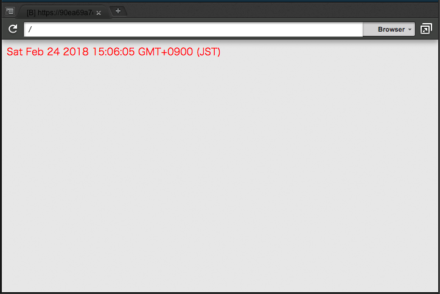

# Headless Chrome on Cloud9 ハンズオン

[AWS Cloud9](https://aws.amazon.com/cloud9/) 上で [Headless Chrome](https://chromium.googlesource.com/chromium/src/+/lkgr/headless/README.md) を使ってみるハンズオンです。

**Cloud9** は、ブラウザーのみでコードを記述、実行、デバッグできるクラウドベースの統合開発環境 (IDE) です。
クラウド上の Linux インスタンスをブラウザーから覗くというスタイルなので、ローカルマシンへのインストールは一切不要です。

**Headless Chrome** は、GUI を必要としない Chrome ブラウザーです。
GUI のない（まさに Cloud9 インスタンスのような）Linux 上でも簡単に実行でき、ブラウザー操作を自動化するのに役立ちます。

対象読者は以下のとおりです：

- Headless Chrome を使ったことがない人
- Cloud9 を使ったことがない人
- どちらも使ったことはあるが、組み合わせて使ったことはない人

[Angular](https://angular.io/) や [React](https://reactjs.org/) といったフレームワークは使わないので HTML, JavaScript が少しでも書けるなら大丈夫です。


## Cloud9 セットアップ

### Why Cloud9?

他のクラウド IDE には、たとえば [Codeanywhere](https://codeanywhere.com/) があります。
クラウド IDE の中から Cloud9 を選択したのは、Codeanywhere が劣っているからではなく、既に持っていた AWS アカウントによって Cloud9 を簡単に利用できたからです。

必要なのは AWS EC2 の利用料のみで、EC2 の知識があれば VPC 内の他のサーバーと連携することも可能という柔軟性を持ち、とにかくハードルが低いのがよいですね。

### Create environment

AWS console にログインし Cloud9 のページを開きます。
Cloud9 は東京リージョンでは使えないので、`Asia Pacific (Singapore)` を選択します。

Cloud9 のページで `Create environment` を選択します。
Name は、ファイル名をつける感覚で、好きなものを設定すればよいです。
Environment settings は、デフォルト (`EC2`, `t2.micro`, `After 30 minutes`) のまま、`Create environment` を選択します。

数分待てばインスタンスが起動し、セットアップは完了です。
簡単！

コードを書くまえに [Git セットアップ (optional)](docs/git-setup.md) をおすすめします。


## Web アプリケーションの作成

サンプルは [kazuma1989/headless-chrome-cloud9-handson: Try Headless Chrome (with Puppeteer) on AWS Cloud9 (EC2 Amazon Linux).](https://github.com/kazuma1989/headless-chrome-cloud9-handson) にあります。

### Node.js プロジェクトの初期化

サーバーを起動したり、Headless Chrome を操作したりするため、[Node.js](https://nodejs.org/en/) を使います。
まず、Cloud9 にデフォルトでインストールされている Node.js のバージョン (v6.12.3) をアップグレードします：

```bash
nvm install 8.9.4
nvm alias default v8.9.4
```

次に、自分のプロジェクトフォルダーを作成し、Node.js プロジェクトとして初期化します：

```bash
cd ~/environment/
mkdir myapp
cd myapp
npm init -y
```

`package.json` が生成されたら成功です：

```diff
+ myapp/
+ └── package.json
```

### index.html 作成

index.html を追加します。
Headless Chrome の動作を確認するため、最低限のスタイルとスクリプトを追加しています：

```diff
  myapp/
+ ├── index.html
  └── package.json
```

```html
<!DOCTYPE html>
<meta charset="UTF-8">
<title>My App</title>
<style>
    main {
        color: red;
    }
</style>

<main></main>
<script>
    document.querySelector('main').textContent = new Date();
</script>
```

### serve インストール

index.html を見る web サーバーとして `serve` をインストールします：

```bash
npm install --save-dev serve
```

```diff
  myapp/
  ├── index.html
+ ├── node_modules
  ├── package.json
+ └── package-lock.json
```

package.json には `serve` スクリプトを追加し、`npm run serve` によってサーバーが起動するようにしておきます：

```diff
   "scripts": {
+    "serve": "serve ./",
     "test": "echo \"Error: no test specified\" && exit 1"
   },
```

`npm run serve` によってサーバーを起動したら、Cloud9 メニュー > Preview > Preview Running Application を選択して、アプリケーションを表示します。
以下のような画面が表示されれば成功です：




## Headless Chrome によるテスト作成

### Why Headless Chrome? Puppeteer?

他のヘッドレスブラウザーには、たとえば [PhantomJS](http://phantomjs.org/) や [Nightmare](http://www.nightmarejs.org/) があります。
これらは独自のエンジンや [Electron](https://electronjs.org/) ベースのエンジン、すなわち Chrome とは異なったエンジンで動作するのに対し、Headless Chrome は Chrome 本体の起動モードの一つです。
とくに理由がなければ、ユーザーが使う「本物」でテストできるほうが好ましいでしょう。

[Puppeteer](https://github.com/GoogleChrome/puppeteer) は、Headless Chrome の Node.js API です。
同様のライブラリーにたとえば [Chromeless](https://github.com/graphcool/chromeless) がありますが、Puppeteer は Chrome 開発チーム製である点で、一線を画しています。

### Puppeteer インストール

Puppeteer にはデフォルトで Chrome が同梱されるので、インストールはこれだけです：

```bash
npm install --save-dev puppeteer
```

### smoke.test.js 作成

アプリケーションが煙をあげていないかチェックする、最低限のテストを追加します。
とは言っても、スクリーンショットを 1 枚撮るだけです：

```diff
  myapp/
  ├── index.html
  ├── node_modules
  ├── package.json
  ├── package-lock.json
+ └── smoke.test.js
```

```js
const puppeteer = require('puppeteer');

(async() => {
    const browser = await puppeteer.launch();
    const page = await browser.newPage();

    await page.goto('http://localhost:8080/');
    await page.screenshot({ path: 'screenshot.png' });

    await page.close();
    await browser.close();
})();
```

package.json に test スクリプトの定義を追加しておきます：

```diff
   "scripts": {
     "serve": "serve ./",
-    "test": "echo \"Error: no test specified\" && exit 1"
+    "test": "node ./smoke.test.js"
   },
```

`npm run serve` でアプリケーションを起動し、別のターミナルから `npm run test` を実行することでテストができます…：

```bash
(node:8637) UnhandledPromiseRejectionWarning: Unhandled promise rejection (rejection id: 1): Error: Failed to launch chrome!
/home/ec2-user/environment/myapp/node_modules/puppeteer/.local-chromium/linux-536395/chrome-linux/chrome: error while loading shared libraries: libXcursor.so.1: cannot open shared object file: No such file or directory


TROUBLESHOOTING: https://github.com/GoogleChrome/puppeteer/blob/master/docs/troubleshooting.md

(node:8637) [DEP0018] DeprecationWarning: Unhandled promise rejections are deprecated. In the future, promise rejections that are not handled will terminate the Node.js process with a non-zero exit code.
```

おや、エラーになってしまいました。
解決しましょう。


## Troubleshooting Puppeteer on Cloud9

### Run Headless Chrome on EC2 Amazon Linux

エラーの内容や、[TROUBLESHOOTING](https://github.com/GoogleChrome/puppeteer/blob/master/docs/troubleshooting.md) のリンク先を見ると、どうやら依存パッケージが不足しているようです。
この問題は、`shared libraries: libXcursor.so.1` というメッセージやリンク先の手順を手がかりにパッケージをインストールしても、素直には解決しませんでした。

しばらく検索したあと、次ような投稿を見つけ、解決することができました。
最高、ありがとう！：

- [MockingBot - Run Puppeteer/Chrome Headless on EC2 Amazon Linux](https://mockingbot.com/posts/run-puppeteer-chrome-headless-on-ec2-amazon-linux)

ここに書かれている、必要なコマンドは、次のスクリプトにまとめたので、これを実行するだけで OK です：  
[install-chrome-dependencies.sh](install-chrome-dependencies.sh)

```bash
sh install-chrome-dependencies.sh
```

`npm run serve` の後に `npm run test` で、今度こそテストが実行され、スクリーンショットが生成されます：


🎉

### Install a Japanese font


## アプリケーション拡張 - ajax 機能の追加

### script.js 作成

### JSON Server インストール

### JSON API のモックテスト


# Optional trainings

## Install Jest

## Install Webpack

## Install SPA frameworks
